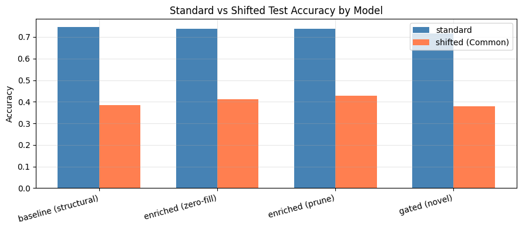

# malnet-shift-robustness

How far does a graph neural network's accuracy fall when Android malware stops looking like its training data, and does telling the model which features are missing help it hold up?

This project reproduces part of Tran et al.'s MalNet-Tiny benchmark [1] and tests one extension: a gating model that takes a missingness mask as input, so the model knows which feature groups are absent instead of reading zero-filled columns.

**Read the full report:** [paper/final_report.pdf](paper/final_report.pdf), also on [adityarao.co](https://www.adityarao.co/research/malnet-robustness-report.pdf).

## Results

Every model was trained on the standard MalNet-Tiny split and evaluated twice: on the standard test set, and on Tran et al.'s MalNet-Tiny-Common split, where the malware shifts away from what the model trained on. The robustness gap is standard accuracy minus shifted accuracy, so smaller is better.

| Model | Standard acc | Shifted acc | Robustness gap |
|---|---|---|---|
| GCN + structural features | 0.746 | 0.384 | 0.362 |
| EnrichedGCN + zero-fill | 0.737 | 0.412 | 0.325 |
| EnrichedGCN + prune | 0.738 | 0.428 | **0.310** |
| GatedGCN (proposed) | 0.717 | 0.380 | 0.337 |

- Training with simulated missing features cut the robustness gap from 36.2 to 31.0 points.
- The gating model did not beat the simpler enriched models. Its gap sits between the baseline and both of them. The most likely reason is that the extra features here are synthetic, computed from the graph itself, so there is little real signal for the gate to work with. Rerunning with Tran et al.'s real APK metadata is the obvious next step.
- Under shift, GatedGCN predicted 173 of 200 adware samples as benign. That failure does not appear on the standard split.

One detail worth knowing if you build on this: the Common split and PyG's `MalNetTiny` class assign different integers to the same five class names (alphabetical order versus first appearance). Without a label remap, every shifted accuracy comes out wrong. `make_label_remap` in `src/shift_loader.py` builds the remap, `[4, 0, 1, 2, 3]` for these splits, and it is applied before any evaluation runs.

## How it works

The notebooks build on each other and should run in order.

| Notebook | What it does |
|---|---|
| [baseline.ipynb](notebooks/baseline.ipynb) | Vanilla GCN on one-hot node degree. 75.1% on the MalNet-Tiny test set. |
| [phase1_structural.ipynb](notebooks/phase1_structural.ipynb) | Swaps in 11 structural features per node: Local Degree Profile, clustering, PageRank and BFS depth. |
| [phase2_enriched.ipynb](notebooks/phase2_enriched.ipynb) | Adds a second, graph-derived feature group and drops feature groups at random during training, handled by zero-fill or prune. |
| [phase3_gating.ipynb](notebooks/phase3_gating.ipynb) | The proposed GatedGCN: a small MLP reads the missingness mask and gates the pooled graph embedding. |
| [phase4_shifted.ipynb](notebooks/phase4_shifted.ipynb) | Retrains all four variants from scratch and evaluates each one on the standard and Common splits. |

All four variants train for 50 epochs with Adam (learning rate 0.001), batch size 64 and seed 42. Each takes roughly 70 to 100 seconds on a T4 GPU.

## Running it

1. Open a notebook in Google Colab.
2. Set the runtime to a T4 GPU.
3. Run all cells. The first cells install the dependencies and clone this repository. Results are written to `results/`.

To run locally instead, install `requirements.txt`, or `requirements-lock.txt` for the exact versions, and check the setup with `pytest tests/`.

## Limitations

- The semantic features are synthetic. Tran et al. extract real metadata from APKs with Androguard, which was too heavy for a Colab budget.
- Only the Common (covariate shift) split is evaluated. The harder Distinct split is left for future work.
- Training differs from Tran et al.'s: mean pooling rather than max, Adam rather than AdamW with cosine annealing, and 50 epochs rather than 150. That explains part of the gap to their 85.6% GCN baseline.
- Graphs over 4,000 nodes get zeros for the clustering, motif-count and two-hop features, to keep the dense matrix multiply from running out of memory.

## Repository layout

- `notebooks/`: the five experiment notebooks
- `src/`: data loading, feature generation, missingness simulation, the models and training
- `scripts/`: the baseline runner and the generators that build the phase notebooks
- `paper/`: the report source, the compiled PDF and its figures
- `tests/`: an import smoke test

## References

1. N. N. Tran, A. Said, W. Abbas, T. Derr and X. D. Koutsoukos. "Quantifying the Generalization Gap: A New Benchmark for Out-of-Distribution Graph-Based Android Malware Classification." arXiv:2508.06734, 2025. https://arxiv.org/abs/2508.06734
2. S. Freitas, Y. Dong, J. Neil and D. H. Chau. "MalNet: A Large-Scale Database for Graph Representation Learning." ICLR Workshop on Graph Neural Networks and Beyond, 2021.
3. N. N. Tran. MalNet-Tiny-Features. Hugging Face Datasets, 2025. https://huggingface.co/datasets/nntvu/MalNet-Tiny-Features

## License

MIT. See [LICENSE](LICENSE).
